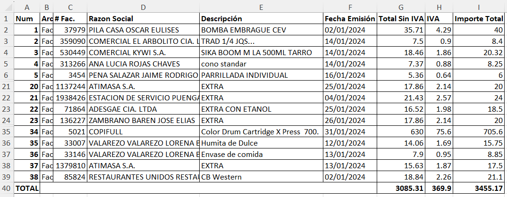
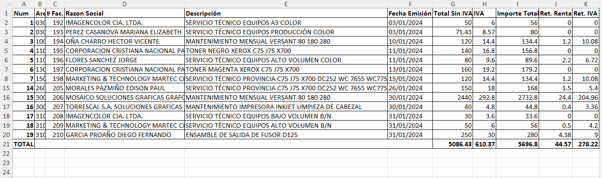

## Script de generación de reportes para declaración del IVA

Este script está diseñado para ayudar a personas naturales que llevan a cabo la declaración mensual de sus impuestos, un proceso que a menudo se realiza de manera manual revisando factura por factura y llenando hojas de cálculo Excel o incluso documentos en papel. El objetivo del script es automatizar este proceso, ahorrando tiempo y reduciendo errores.

El script en Python toma una carpeta (especificada como variable) que contiene archivos XML de facturas y retenciones descargados del SRI, y procesa cada archivo para extraer datos clave como razón social, productos comprados o vendidos, valores con IVA, sin IVA y el total. Para las ventas, también se incluyen las retenciones de renta e IVA. Como resultado, se generan dos reportes en formato Excel.

Este script es especialmente útil para quienes gestionan su declaración del IVA, ya que les proporciona una visión clara y estructurada de sus transacciones, permitiendo llevar un mejor control y respaldo de sus datos fiscales.

### Ejemplo de reportes generados:

1. **Compras del mes**  
   

2. **Ventas del mes**  
   
